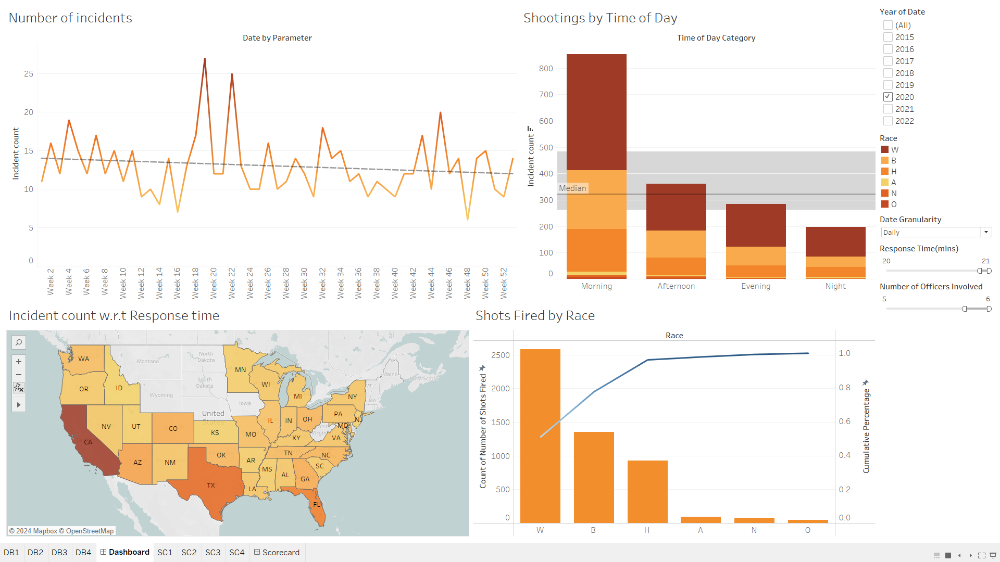
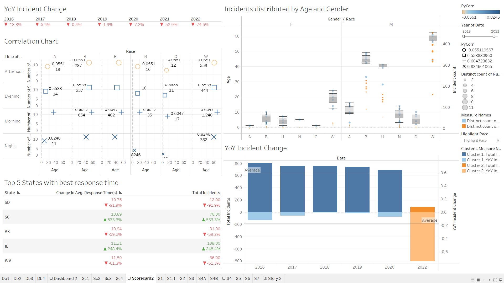
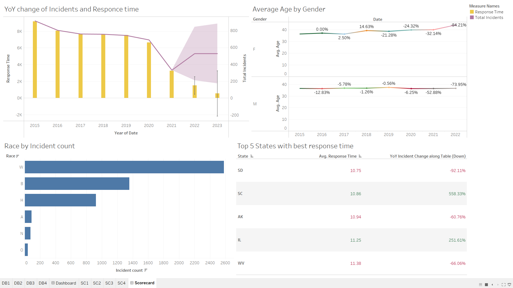

# Data Visualization Insights on US Police Shooting Incidents
This repository hosts a data visualization project focused on incidents of police shootings in the United States. The project aims to provide insight into the frequency, distribution, and contextual factors surrounding police shootings across different states and demographics.

## Introduction:
The US Police Shooting Visualization project delves into the multifaceted landscape of incidents involving law enforcement officers in the United States. Through a meticulous analysis of available data and the application of advanced visualization techniques, this project aims to shed light on various dimensions of these incidents, facilitating a deeper understanding of the underlying patterns, trends, and potential root causes.

1. Data Discoveries:

  - The exploration of the dataset has unveiled several intriguing insights:
    - Notable disparities exist in the distribution of incidents across racial demographics, with certain groups experiencing a disproportionate number of incidents.
    - Geographical analysis reveals variations in incident counts across states, indicating potential regional disparities or differing policing policies.
    - Temporal examination highlights fluctuations in incident frequency over time, with discernible trends emerging from the data.
2. Patterns and Trends:

  - A comprehensive analysis of the data has revealed recurring patterns and discernible trends:
    - Demographic patterns suggest specific age and gender groups are more frequently involved in police shooting incidents, raising questions about underlying societal factors.
    - Temporal analysis indicates fluctuating incident frequencies over time, with certain periods showing notable increases or decreases in incidents.
    - Geospatial analysis unveils clustering of incidents in certain regions, hinting at potential localized issues or regional disparities in law enforcement practices.
3. Root-Cause Analysis:

  - Identifying potential root causes requires a meticulous examination of various factors:

    - Increasing response times may stem from staffing shortages, resource constraints, or changes in incident complexity, necessitating a deeper exploration of operational challenges.
    - Racial disparities in incident counts raise concerns about systemic biases, community-police relations, and law enforcement practices, warranting a critical assessment of societal and institutional dynamics.
    - Variability in incident frequencies across states may reflect differences in policing strategies, resource allocation, or community demographics, underscoring the need for localized interventions and tailored approaches.
4. Insights and Recommendations:

  - Drawing from the analysis, several actionable insights and recommendations emerge:
    - Targeted community policing initiatives, enhanced training programs, and improved community engagement efforts could help mitigate racial disparities and foster trust between law enforcement and communities.
    - Investments in technology, resource optimization, and data-driven decision-making could streamline law enforcement operations, improve response times, and enhance overall policing effectiveness.
    - Continuous monitoring of key performance metrics, coupled with proactive measures to address underlying systemic issues, is essential for fostering accountability, transparency, and positive change within law enforcement agencies.

## Sample Visualizations

## Conclusion:
In conclusion, the US Police Shooting Visualization project offers a nuanced understanding of the complex dynamics surrounding incidents involving law enforcement officers in the United States. By leveraging data visualization techniques and rigorous analysis, this project aims to inform evidence-based decision-making, drive policy reforms, and contribute to efforts aimed at promoting fairness, justice, and public safety.

## Appendices:
Detailed charts, data tables, and supplementary analysis outputs are provided to support the findings presented in this report.
